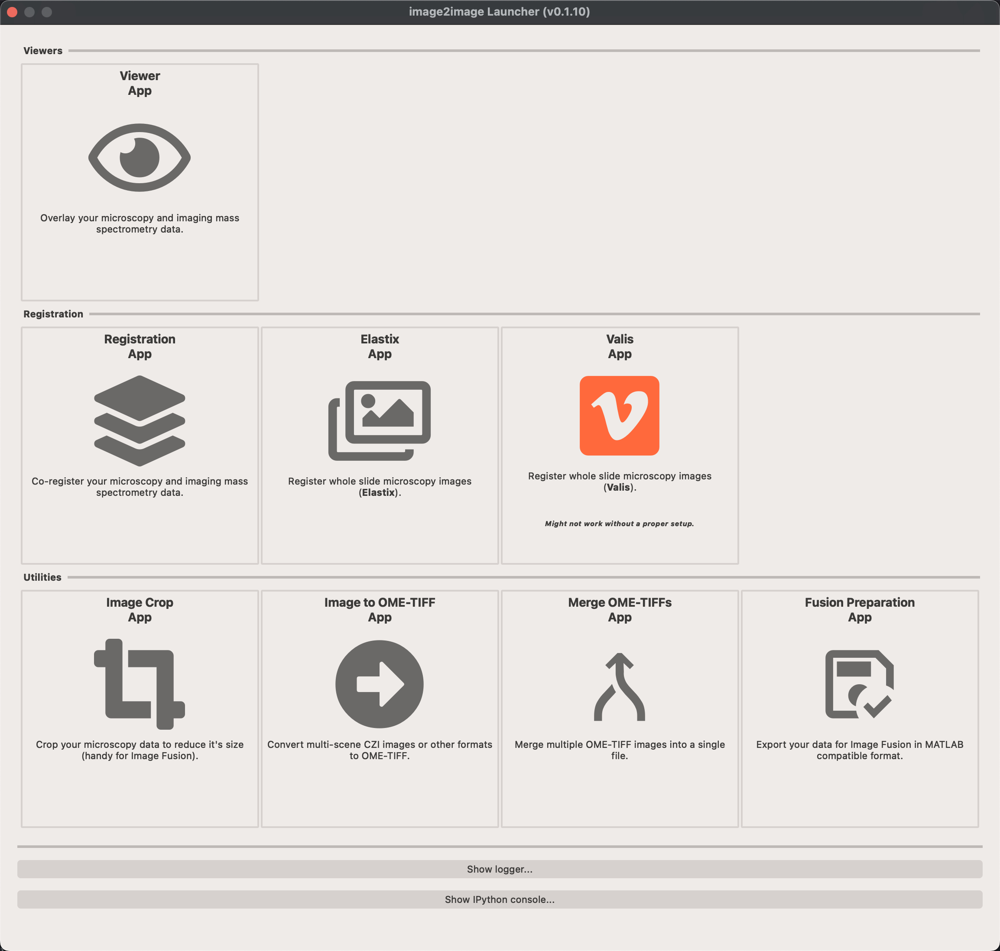
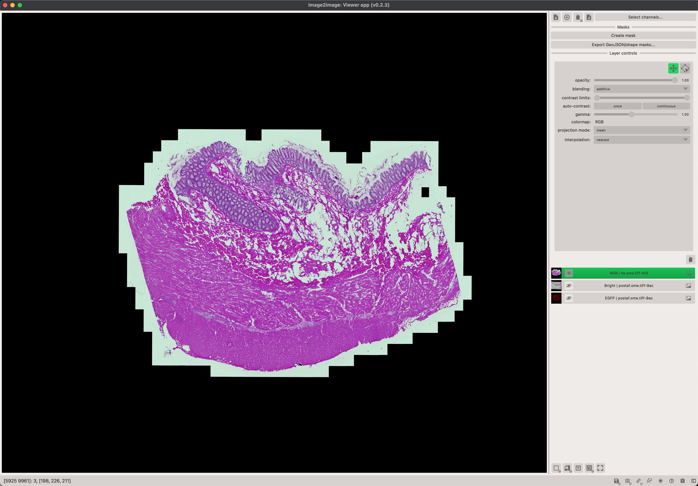
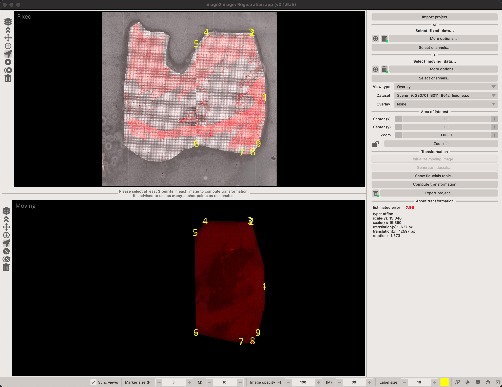

# image2image

[](https://github.com/vandeplaslab/image2image/raw/main/LICENSE)
[](https://pypi.org/project/image2image)
[](https://python.org)
[](https://github.com/vandeplaslab/image2image/actions/workflows/ci.yml)
[](https://codecov.io/gh/vandeplaslab/image2image)

**Explore, align, and prepare scientific images in one place.**

image2image is a desktop toolkit for visualizing and registering whole-slide
images, microscopy data, and imaging mass spectrometry datasets. It brings a
collection of focused applications together behind one launcher, so you can
move from inspection to registration to export without changing tools.

<p align="center">
  
</p>

## Why image2image?

- **See multiple modalities together.** Overlay images, channels, masks, and
  point data in a shared viewer, with per-dataset scaling and transformations.
- **Register images interactively.** Create affine registrations with
  fiducial points, preview the result, and save reusable transformation files.
- **Register whole-slide images.** Build Elastix or Valis workflows with
  preprocessing, masks, registration paths, and batch execution.
- **Prepare data for downstream tools.** Convert images to OME-TIFF, crop or
  mask regions, merge channels or files, and export fusion-compatible data.
- **Work from the GUI or command line.** Use the launcher for a guided
  workflow, or invoke individual applications from a terminal.

## Applications at a glance

| Application | Use it for | Launch command |
| --- | --- | --- |
| Viewer | Overlay images, channels, masks, points, and transformations | `i2viewer` |
| Register | Manually align two images with fiducial markers | `i2register` |
| Elastix | Register whole-slide images with Elastix workflows | `i2elastix` |
| Valis | Register whole-slide images with Valis workflows | `image2image -t valis` |
| Runner | Queue and review multiple registration projects | `i2runner` |
| Convert | Convert supported microscopy formats to OME-TIFF | `i2convert` |
| Crop | Crop or mask one or more images | `i2crop` |
| Merge | Combine channels or image files | `image2image -t merge` |
| Fusion | Export data for the MATLAB fusion application | `image2image -t fusion` |

The default `image2image` command opens the launcher, where all available
applications can be started.

## Install

image2image requires Python 3.11 or newer. Install it from PyPI with a Qt
backend, then start the launcher:

```bash
python -m pip install "image2image[pyqt6]"
image2image
```

If you prefer another supported Qt binding, replace `pyqt6` with `pyside6`,
`pyqt5`, or `pyside2`.

For packaged application builds and release notes, see the
[GitHub Releases](https://github.com/vandeplaslab/image2image/releases) page.

## A typical workflow

1. Open the **Viewer** to inspect your images and confirm their pixel sizes.
2. Use **Register** to create an affine transformation between two modalities,
   or choose **Elastix** or **Valis** for whole-slide registration.
3. Review the alignment and export the resulting images or transformation
   files.
4. Use **Crop**, **Convert**, or **Merge** to prepare the final data for
   analysis or sharing.

<p align="center">
  
  
</p>

## Documentation

- [Documentation home](docs/index.md)
- [Viewer guide](docs/apps/viewer.md)
- [Registration guide](docs/apps/register.md)
- [Elastix guide](docs/apps/elastix.md)
- [Valis guide](docs/apps/valis.md)
- [Utility apps](docs/apps/convert.md)
- [Release notes](docs/changelogs/index.md)

## Development

Clone the repository and install the project with its development tools:

```bash
git clone https://github.com/vandeplaslab/image2image.git
cd image2image
python -m pip install -e "[pyqt6,dev]"
```

Contributions are welcome. Please open an issue for a bug report or feature
request, or submit a pull request with a focused change and relevant tests.

## License

image2image is released under the [BSD 3-Clause License](LICENSE).
