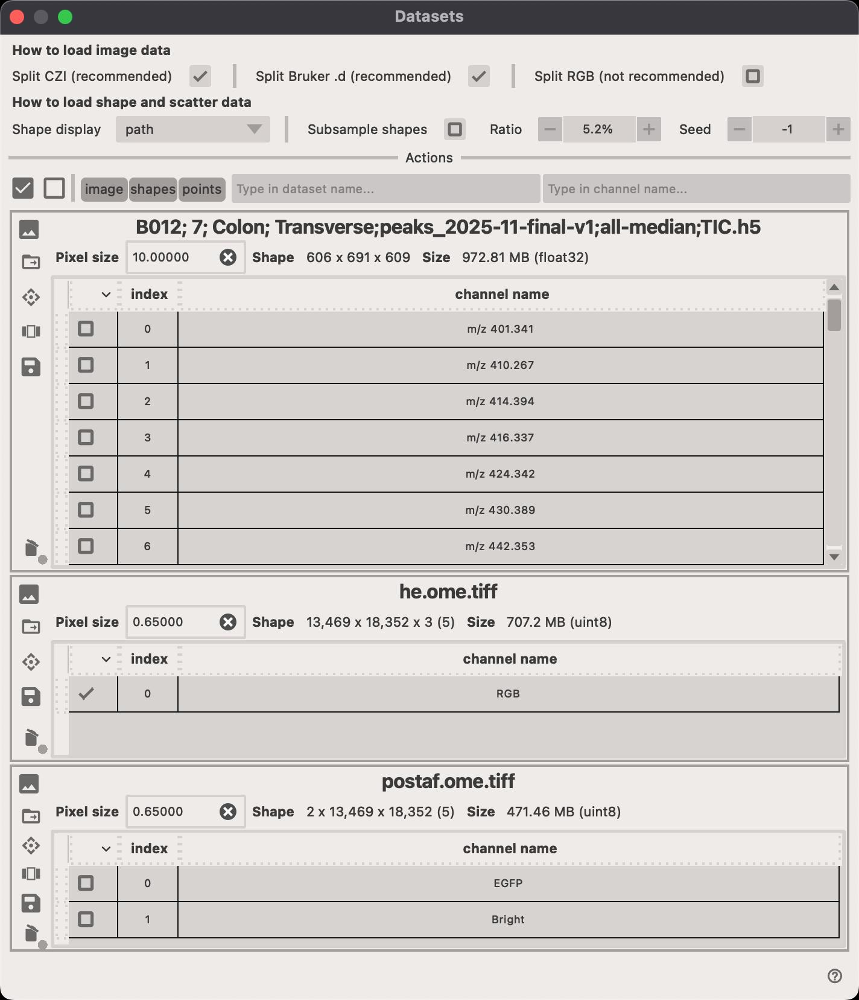

# Datasets and channel selection

When working with multiple datasets (images, masks, annotations, etc.), it is often necessary to select which datasets and channels should be displayed in the viewer.

<figure markdown>
  { width=800px; }
</figure>

Within each `dataset card`, you can perform several actions.

- Click on the `Pixel size` field to adjust the pixel spacing of the dataset.
- Click on the :material-folder: to open the file location of the dataset.
- Click on the :octicons-diamond-24: to select the transformation that should be applied to the dataset.
- Click on the :material-view-carousel-outline: to open a new popup window where you can select which channels should be displayed.
- Click on the :fontawesome-solid-save: to save the current selection of channels as a new dataset.
- Click on the :fontawesome-solid-trash: to delete the entire dataset (all channels).